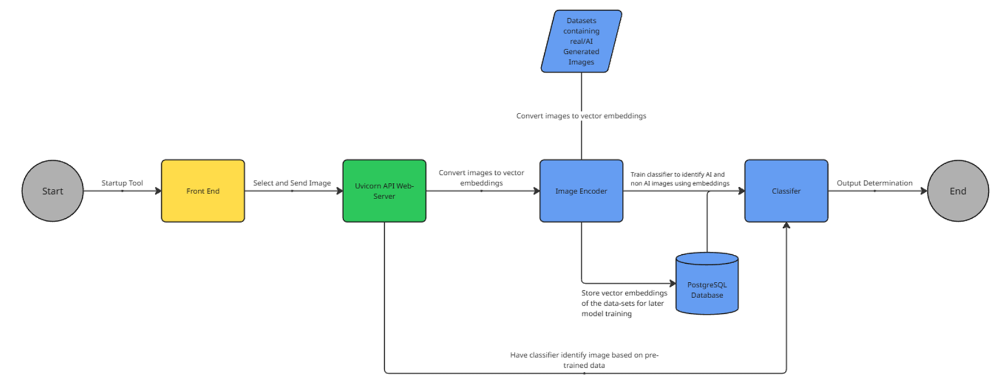

# Welcome
Welcome to Videre, an AI Image detection tool intended as my final project submission for CIS430 (Data Mining) at UMass Dartmouth. The intention of this project were to combine a React/TS UI with a SigLIP image embedder and a logistic regression classifier, allowing a user to input an image of choice and recieve the model's prediction of whether it was generated by AI or not. 

# How to Use 
See the attached requirements.txt for all relevant and necessary dependencies to run Videre properly. 

Most importantly, this project runs on Python 3.11, necessitating the use of the older verison to ensure proper operation. This is due to issues arising early on in development with Pytorch, CUDA, and relevant GPU drivers, necessitating older verisons to match the development enviornment. 

More specifically, for quick and effective operation of the training and testing modules, pytorch MUST be run with GPU enabled, and cuda 12.1 installed with respect to pytorch. Operating on CPU significantly delays embedding time, and will reduce the effectiveness of the modules.

As such, ensure the operating machine has Python 3.11 installed, and use the following commands: -m venv .venv to create a virtual enviornment, and .\.venv\Scripts\activate, to allow for its operation.

Due to issues in running pytorch with 3.13, this project must be ran in a virtual enviornment, using python 3.11, create the folder using python3.11 -m venv .venv and .\.venv\Scripts\activate, deactivate to turn it off.

However, for regular use of the application itself, first open two terminals in command prompt (or any of your choosing), and open the virtual enviornment using .\.venv\Scripts\activate. Then in one terminal, cd to core and run uvicorn api:app --reload --host 127.0.0.1 --port 8000 to enable the uvicorn web server for FastAPI to operate on, and in the other terminal, cd to frontend, and run npm dev, to enable the locally hosted browser application to run.

From there, operation is straight forwards, through the buttons offered on the application. A quick warning as of this submission, error checking is not enabled for the image submission, so clicking the button without having submitted an image, will result in the breaking of the program. This is intended to be fixed after the end of the semester as this project is refined.

Currently both testing and training modules create the additionally stored npy files, these files hold the relevant embedding matrices created by SigLIP. They are stored and generatable here and in the github, for later reuse.

The testing module runs tests on ~2000 images, taken from the same datasets as those used for training, but sliced specifically to avoid reuse and thus errors. All relevant metrics are printable, alongside graphs for better analysis of the program's performance

# Work Flow Diagram
Attached is the current workflow of the program, which is intended to grow and change as the project progresses

# Future Plans 
This project is under development, and many different additions will soon take place.

- UI beautification: Improvement of the UI for user 
- Error handling: Additions of checks to ensure no errors can occur during user operation
- Vector Database: Addition of PostgreSQL DB for vectors using pgvector, replacing the locally saved npy files
- Batch processing: Enabling the embedding and classification of more than one image at a time 
